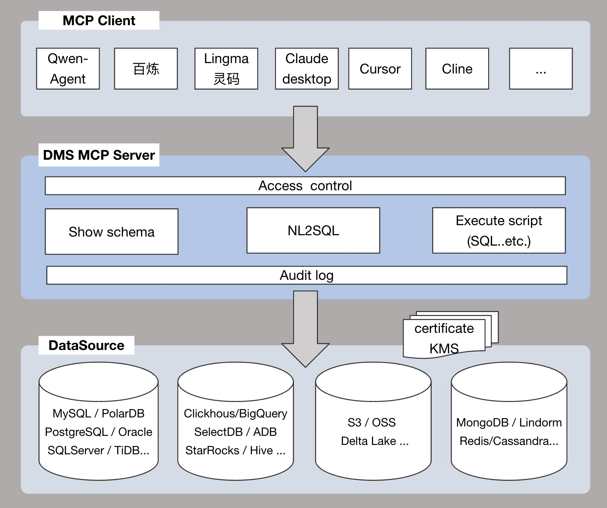

<!-- 顶部语言切换 -->

<p align="center"><a href="../README.md">English</a> | 中文<br></p>

# AlibabaCloud DMS MCP Server

**AI 首选的统一数据管理网关，支持30多种数据源**连接的多云通用数据MCP Server，一站式解决**跨源数据安全访问**。

- 支持阿里云全系：RDS、PolarDB、ADB系列、Lindorm系列、TableStore系列、Maxcompute系列。
- 支持主流数据库/数仓：MySQL、MariaDB、PostgreSQL、Oracle、SQLServer、Redis、MongoDB、StarRocks、Clickhouse、SelectDB、DB2、OceanBase、Gauss、BigQuery等。



---

## 核心特性
为AI提供统一的**数据接入层**与**元数据访问层**，通过标准化接口解决：  
- 数据源碎片化导致的MCP Server维护成本  
- 异构协议间的兼容性问题  
- 账号权限不受控、操作无审计带来的安全问题  

同时，通过MCP将获得以下特性：  
- **NL2SQL**：通过自然语言执行SQL，获得数据结果  
- **代码生成**：通过该服务获取schema信息，生成DAO代码或进行结构分析  
- **取数**：通过SQL自动路由准确数据源获得数据，为上层业务提供数据支持  
- **安全**：精细的访问控制和可审计性  

---

## 支持的数据源
| DataSource/Tool       | **NL2SQL** *nlsql* | **Execute script** *executeScript* | **Show schema** *getTableDetailInfo* | **Access control** *default* | **Audit log** *default* |
|-----------------------|--------------------|------------------------------------|--------------------------------------|-----------------------------|------------------------|
| MySQL                 | ✅                  | ✅                                  | ✅                                    | ✅                           | ✅                      |
| MariaDB               | ✅                  | ✅                                  | ✅                                    | ✅                           | ✅                      |
| PostgreSQL            | ✅                  | ✅                                  | ✅                                    | ✅                           | ✅                      |
| Oracle                | ✅                  | ✅                                  | ✅                                    | ✅                           | ✅                      |
| SQLServer             | ✅                  | ✅                                  | ✅                                    | ✅                           | ✅                      |
| Redis                 | ✅                  | ✅                                  | ✅                                    | ✅                           | ✅                      |
| MongoDB               | ✅                  | ✅                                  | ✅                                    | ✅                           | ✅                      |
| StarRocks             | ✅                  | ✅                                  | ✅                                    | ✅                           | ✅                      |
| Clickhouse            | ✅                  | ✅                                  | ✅                                    | ✅                           | ✅                      |
| SelectDB              | ✅                  | ✅                                  | ✅                                    | ✅                           | ✅                      |
| DB2                   | ✅                  | ✅                                  | ✅                                    | ✅                           | ✅                      |
| OceanBase             | ✅                  | ✅                                  | ✅                                    | ✅                           | ✅                      |
| Gauss                 | ✅                  | ✅                                  | ✅                                    | ✅                           | ✅                      |
| BigQuery              | ✅                  | ✅                                  | ✅                                    | ✅                           | ✅                      |
| PolarDB               | ✅                  | ✅                                  | ✅                                    | ✅                           | ✅                      |
| PolarDB-X             | ✅                  | ✅                                  | ✅                                    | ✅                           | ✅                      |
| AnalyticDB            | ✅                  | ✅                                  | ✅                                    | ✅                           | ✅                      |
| Lindorm               | ✅                  | ✅                                  | ✅                                    | ✅                           | ✅                      |
| TableStore            | ✅                  | ✅                                  | ✅                                    | ✅                           | ✅                      |
| Maxcompute            | ✅                  | ✅                                  | ✅                                    | ✅                           | ✅                      |
| Hologres              | ✅                  | ✅                                  | ✅                                    | ✅                           | ✅                      |

---

## 快速开始
### 下载代码
```bash
git clone https://github.com/aliyun/alibabacloud-dms-mcp-server.git
```

### 配置MCP客户端
在配置文件中添加以下内容：
```json
"mcpServers": {
  "dms-mcp-server": {
    "command": "uv",
    "args": [
      "--directory",
      "/path/to/alibabacloud-dms-mcp-server/src/alibabacloud_dms_mcp_server",
      "run",
      "server.py"
    ],
    "env": {
      "ALIBABA_CLOUD_ACCESS_KEY_ID": "access_id",
      "ALIBABA_CLOUD_ACCESS_KEY_SECRET": "access_key",
      "ALIBABA_CLOUD_SECURITY_TOKEN": "sts_security_token optional, required when using STS Token"
    }
  }
}
```

---

## Contact us

如果您有使用问题或建议, 请加入[Alibaba Cloud DMS MCP讨论组](https://h5.dingtalk.com/circle/joinCircle.html?corpId=dinga0bc5ccf937dad26bc961a6cb783455b&token=2f373e6778dcde124e1d3f22119a325b&groupCode=v1,k1) (钉钉群号: 113455011677) 进行讨论.


## License
This project is licensed under the Apache 2.0 License.
